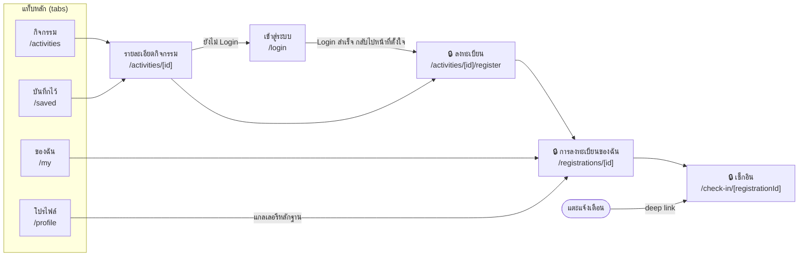
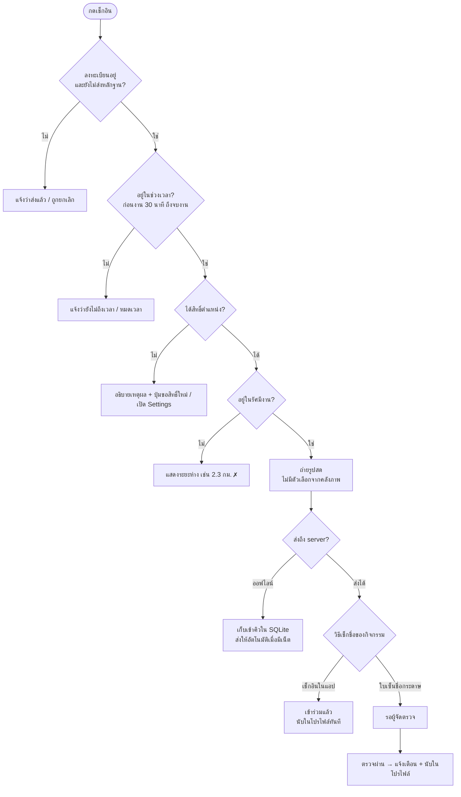
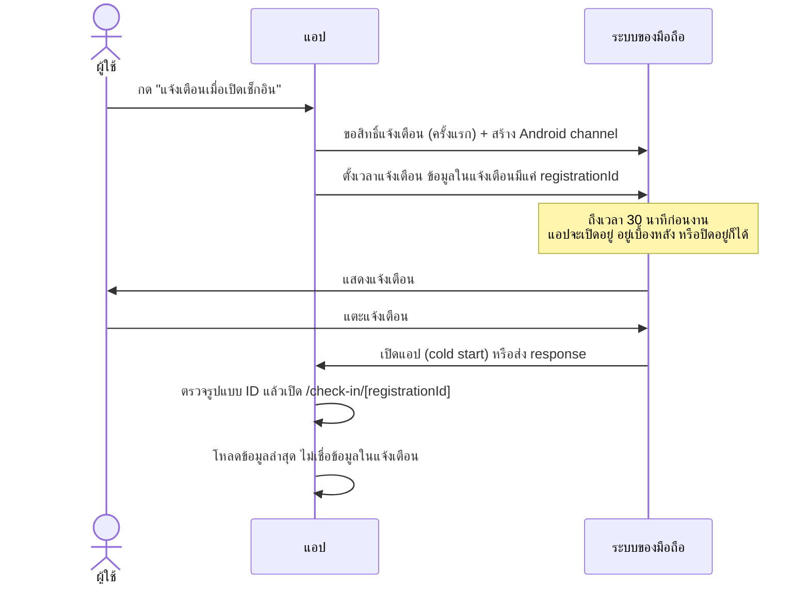
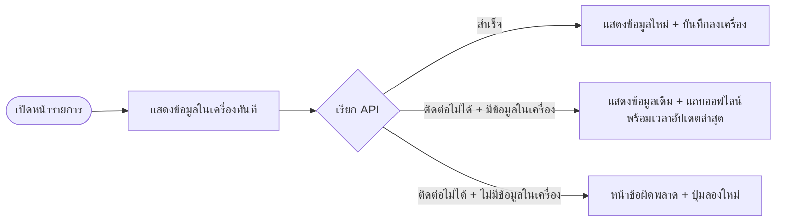

# CampusPass: ไปจริง เช็กอินจริง นับจริง

แอปกิจกรรมมหาวิทยาลัยสำหรับ Assignment 11 รายวิชา Hybrid Mobile Application Programming
รวมเนื้อหาสัปดาห์ 1–11 ไว้ในแอปเดียว สร้างด้วย **React Native + Expo SDK 57 + TypeScript + Expo Router**

| | |
|---|---|
| ผู้พัฒนา | _ชื่อ-นามสกุล_ |
| รหัสนักศึกษา | _รหัสนักศึกษา_ |
| GitHub | _ลิงก์ repository_ |

## แอปนี้แก้ปัญหาอะไร

นักศึกษาต้องเข้าร่วมกิจกรรมให้ครบตามที่มหาวิทยาลัยกำหนด แต่ไม่รู้ว่ามีกิจกรรมอะไรบ้าง ลืมวันงาน
และการเช็กชื่อด้วยกระดาษเซ็นแทนกันได้ CampusPass ช่วยให้

1. ค้นหาและ**ลงทะเบียน**กิจกรรม
2. **แจ้งเตือน**เมื่อเปิดเช็กอิน
3. **เช็กอินด้วยตำแหน่ง + รูปถ่ายสด** หรือถ่ายรูป**ใบเซ็นชื่อกระดาษ**เป็นหลักฐาน
4. **นับจำนวนกิจกรรมที่เข้าร่วม** และเก็บแกลเลอรีหลักฐานไว้ในโปรไฟล์

เหตุผลของทุกฟีเจอร์และฟังก์ชันอยู่ใน [docs/DESIGN.md](docs/DESIGN.md)

## เนื้อหาแต่ละสัปดาห์อยู่ตรงไหนในแอป

| สัปดาห์ | หัวข้อ | ใช้ในแอป | ไฟล์หลัก |
|---|---|---|---|
| 1 | Expo + TypeScript + Profile | หน้าโปรไฟล์ + type ของข้อมูลทั้งหมด | `src/app/(tabs)/profile.tsx`, `src/types/models.ts` |
| 2 | Components, Props, State | การ์ดกิจกรรมที่ใช้ซ้ำ 3 หน้า, ชิ้นส่วน UI กลาง | `src/components/activity-card.tsx`, `src/components/ui.tsx` |
| 3 | Styling, Responsive, Lists | FlatList, 2 คอลัมน์บนจอกว้าง, Loading/Empty/Error | `src/app/(tabs)/activities.tsx` |
| 4 | Expo Router | Tabs + Stack, dynamic route, not-found, deep link `campuspass://` | `src/app/_layout.tsx`, `src/app/(tabs)/_layout.tsx` |
| 5 | Forms + State | ค้นหา/กรอง, บันทึกไว้ (reducer + Context), ฟอร์มลงทะเบียน (reducer + validation) | `src/state/favorites-*.ts(x)`, `src/state/registration-form-reducer.ts`, `src/app/activities/[id]/register.tsx` |
| 6 | REST API | API server ใน repo, service layer, ตรวจข้อมูลตอนรัน, retry, pull-to-refresh, idempotency key | `server/index.mjs`, `src/services/api-client.ts`, `src/services/campus-api.ts` |
| 7 | Storage + Offline | AsyncStorage (บันทึกไว้, cache), SQLite (การลงทะเบียน + คิวเช็กอินออฟไลน์), แถบออฟไลน์ | `src/storage/*` |
| 8 | Authentication | Login, token ใน SecureStore, `Stack.Protected`, ฟื้น session, logout ล้างข้อมูล | `src/state/session-context.tsx`, `src/app/login.tsx` |
| 9 | Camera | ถ่ายรูปสดตอนเช็กอิน / ถ่ายใบเซ็นชื่อ, ขอสิทธิ์ตอนใช้งาน, ย่อรูปก่อนส่ง | `src/app/check-in/[registrationId].tsx`, `src/services/photo.ts` |
| 10 | Location + Maps | ตรวจว่าอยู่ในรัศมีงาน, แผนที่ + วงกลมพื้นที่เช็กอิน, นำทาง | `src/services/location.ts`, `src/components/activity-map(.web).tsx`, `src/lib/check-in-rules.ts` |
| 11 | Notifications | เตือนเมื่อเปิดเช็กอิน, แตะแล้วเปิดหน้าเช็กอิน, แจ้งเมื่อหลักฐานตรวจผ่าน | `src/services/reminders.ts`, `src/hooks/use-notification-routing.ts` |
| เสริม | Testing | Jest + React Native Testing Library 26 tests | `__tests__/*` |

งานเดิมของรายวิชานำมาต่อยอดดังนี้: **Profile** → หน้าโปรไฟล์และจำนวนกิจกรรม,
**Pokemon Team Builder** → แนวคิดค้นหา + กรองตามประเภท + รายการโปรดที่บันทึกในเครื่อง,
**Camera** → ถ่ายรูปหลักฐานการเข้าร่วม, **Location and map** → ตรวจรัศมีและแผนที่สถานที่จัดงาน

## ติดตั้งและรัน

ต้องมี **Node.js LTS (20 ขึ้นไป)** และแอป **Expo Go** บนมือถือ (รองรับ SDK 57)

```bash
git clone <ลิงก์ repository>
cd <โฟลเดอร์โปรเจกต์>
npm install
npm start
```

`npm start` เปิด **API server (พอร์ต 3001)** และ **Expo** พร้อมกันในคำสั่งเดียว

- **มือถือ:** ต่อ Wi-Fi วงเดียวกับคอมพิวเตอร์ แล้วสแกน QR ด้วย Expo Go (Android) หรือกล้อง (iOS)
  แอปหาที่อยู่ API ให้อัตโนมัติจาก IP ของคอมพิวเตอร์ ไม่ต้องสร้าง `.env`
- **เว็บ:** กด `w` ใน terminal หรือรัน `npm run web` แล้วเปิด http://localhost:8081

### บัญชีทดสอบ (ข้อมูลตัวอย่าง ไม่ใช่บัญชีจริง)

| รหัสนักศึกษา | รหัสผ่าน |
|---|---|
| 6601234567 | campus1234 |
| 6609876543 | campus1234 |

### ถ้าเชื่อมต่อ API ไม่ได้

1. เปิด `http://<IP-คอมพิวเตอร์>:3001/health` ในเบราว์เซอร์ของมือถือ ต้องเห็น `{"ok":true,...}`
2. ถ้าเปิดไม่ได้ ให้อนุญาต Node.js ใน Windows Firewall (Private network) สำหรับพอร์ต 3001
3. ไม่รองรับโหมด `--tunnel` เพราะ API อยู่ในเครื่อง ถ้าจำเป็นให้สร้างไฟล์ `.env` แล้วใส่ `EXPO_PUBLIC_API_URL=http://<IP>:3001`
4. ข้อมูลใน server เก็บที่ `server/.data/` ลบโฟลเดอร์นี้เพื่อเริ่มใหม่

## ขั้นตอนสาธิต (วันสอบ Final)

1. **ค้นหา:** แท็บกิจกรรม → พิมพ์ค้นหา / กรองประเภท → กด ☆ บันทึกไว้ (ปิดแอปแล้วเปิดใหม่ยังอยู่)
2. **Login:** กดลงทะเบียน → ระบบพาไป Login แล้วกลับมาที่ฟอร์มต่อ
3. **ลงทะเบียน:** ลองส่งฟอร์มที่กรอกผิดเพื่อดู validation → ส่งสำเร็จ → ตั้งแจ้งเตือน
4. **แจ้งเตือน:** กด "โหมดสาธิต: ทดสอบแจ้งเตือนใน 10 วินาที" → ออกไปหน้า Home → แตะแจ้งเตือน → เปิดหน้าเช็กอิน
5. **เช็กอินไม่ผ่าน:** กิจกรรม "สาธิตระบบเช็กอิน" อยู่ไกล → แอปบอก "ห่าง x กม." ปุ่มกล้องกดไม่ได้
6. **เช็กอินผ่าน:** กด "โหมดสาธิต: ย้ายสถานที่จัดงานมาที่ตำแหน่งฉัน" → ถ่ายเซลฟี่ → ส่ง → นับในโปรไฟล์ทันที
7. **ใบเซ็นชื่อกระดาษ:** กิจกรรม "ค่ายอาสา" → ถ่ายรูปใบเซ็นชื่อ → สถานะ "รอตรวจ" → ประมาณ 8 วินาทีผู้จัด (จำลอง) ตรวจผ่าน → แจ้งเตือน + นับในโปรไฟล์
8. **ออฟไลน์:** เปิดโหมดเครื่องบิน → รายการกิจกรรมและ "ของฉัน" ยังเปิดได้พร้อมแถบออฟไลน์ → เช็กอินแล้วเก็บเข้าคิว → ปิดโหมดเครื่องบิน → ส่งให้อัตโนมัติ
9. **Logout:** โปรไฟล์ → ออกจากระบบ (ล้าง token, cache และการแจ้งเตือน)

ปุ่ม "โหมดสาธิต" แสดงเฉพาะตอนรันแบบพัฒนา (`__DEV__`) และ server ต้องเปิด demo mode (ค่าเริ่มต้น)

## ตรวจคุณภาพ

```bash
npm run typecheck   # TypeScript
npm run lint        # ESLint
npm test            # Jest 26 tests
npx expo-doctor     # ความเข้ากันของ package กับ SDK
```

## แผนภาพการทำงาน

### 1. แผนผังหน้าจอ (Expo Router)

แท็บหลัก 4 หน้าอยู่ใน `(tabs)` ส่วนหน้ารายละเอียด ลงทะเบียน และเช็กอินอยู่ใน Root Stack จึงมีปุ่มย้อนกลับอัตโนมัติ
หน้าที่มีกุญแจ 🔒 ต้อง Login ก่อน (`Stack.Protected`)



### 2. ขั้นตอนเช็กอิน

ตรวจตามลำดับที่ผู้ใช้ควรรู้ก่อน: สถานะ → เวลา → ตำแหน่ง → รูป (`src/lib/check-in-rules.ts`)
server ตรวจเวลาและระยะทางซ้ำอีกรอบ เพราะค่าที่ส่งจากแอปแก้ไขได้



### 3. วงจรการแจ้งเตือน



### 4. การอ่านข้อมูลแบบออฟไลน์ก่อน (offline-first)



## ผลการทดสอบ

### ทดสอบด้วยมือบนมือถือ (Expo Go)

| # | กรณีทดสอบ | ผลที่คาดไว้ | ผล |
|---|---|---|---|
| 1 | เปิดแอป ต่อ Wi-Fi วงเดียวกับคอม | รายการกิจกรรมโหลดจาก server | ✅ |
| 2 | Login ด้วยบัญชีทดสอบ | เข้าระบบได้ แท็บของฉัน/โปรไฟล์แสดงข้อมูล | ✅ |
| 3 | ส่งฟอร์มลงทะเบียนที่กรอกเบอร์ผิด | ขึ้น error ใต้ช่องเบอร์ ไม่ส่งข้อมูล | ✅ |
| 4 | ลงทะเบียนสำเร็จ | สถานะ "ลงทะเบียนแล้ว" ที่นั่งคงเหลือลดลง | ✅ |
| 5 | ตั้งแจ้งเตือนทดสอบ 10 วินาที แล้วปิดแอป | แจ้งเตือนเด้ง แตะแล้วเปิดหน้าเช็กอิน | ✅ |
| 6 | เช็กอินขณะอยู่ไกลจากงาน | แสดงระยะห่าง ปุ่มกล้องกดไม่ได้ | ✅ |
| 7 | ย้ายสถานที่ (โหมดสาธิต) แล้วถ่ายเซลฟี่ส่ง | เข้าร่วมแล้ว โปรไฟล์นับเพิ่ม 1 | ✅ |
| 8 | ส่งรูปใบเซ็นชื่อกระดาษ | รอตรวจ → ประมาณ 8 วินาทีตรวจผ่าน + แจ้งเตือน + นับเพิ่ม | ✅ |
| 9 | เปิดโหมดเครื่องบินแล้วรีเฟรช | รายการยังอยู่ + แถบออฟไลน์ | ✅ |
| 10 | ปิดแอปแล้วเปิดใหม่ตอนออฟไลน์ | ยังเข้าระบบอยู่ แท็บของฉันเปิดได้ | ✅ |
| 11 | ออกจากระบบ | แท็บของฉันขอให้ Login ใหม่ | ✅ |
| 12 | ยังไม่ Login แล้วกดลงทะเบียน | ไปหน้า Login แล้วกลับมาที่ฟอร์มลงทะเบียน | ⬜ ยังไม่ได้ยืนยันแยก |
| 13 | เช็กอินขณะออฟไลน์ แล้วเปิดเน็ต | เก็บเข้าคิว แล้วส่งให้อัตโนมัติ | ⬜ ยังไม่ได้ยืนยันแยก |

### ทดสอบ API (server ตอบถูกทุกกรณี)

| กรณี | ผลที่คาดไว้ | ผล |
|---|---|---|
| Login รหัสผ่านผิด | 401 ข้อความเดียวกับกรณีไม่มีผู้ใช้ | ✅ |
| ลงทะเบียนซ้ำด้วย Idempotency-Key เดิม | คืนรายการเดิม ไม่สร้างใหม่ | ✅ |
| ลงทะเบียนกิจกรรมที่เต็มแล้ว | 409 activity_full | ✅ |
| ส่งฟอร์มข้อมูลผิดรูปแบบ | 400 พร้อม error แยกรายช่อง | ✅ |
| เช็กอินนอกรัศมี | 409 too_far พร้อมระยะห่าง | ✅ |
| เช็กอินในรัศมี | 200 สถานะ checked_in | ✅ |
| เรียก API ด้วย token ผิด | 401 → แอปออกจากระบบอัตโนมัติ | ✅ |

### ทดสอบอัตโนมัติ

| คำสั่ง | ผล |
|---|---|
| `npm test` | ✅ ผ่าน 26/26 |
| `npm run typecheck` | ✅ ไม่มี error |
| `npm run lint` | ✅ ไม่มี error |
| `npx expo-doctor` | ✅ ผ่าน 21/21 |

## ข้อจำกัดที่ทราบ

- **การแจ้งเตือนใช้ได้บนมือถือเท่านั้น** เว็บไม่รองรับ local notification (แอปแสดงข้อความแทนปุ่ม)
- **กล้องและตำแหน่งบนเว็บ** ใช้ได้เมื่อเปิดผ่าน `localhost` หรือ HTTPS เท่านั้น (ข้อกำหนดของเบราว์เซอร์)
  การเปิดเว็บจากมือถือผ่าน `http://<IP>` จะใช้กล้อง/ตำแหน่งไม่ได้ ให้ใช้ Expo Go แทน
- **บนเว็บ** token เก็บใน `sessionStorage` (ปิดแท็บแล้วต้อง login ใหม่) และใช้ AsyncStorage แทน SQLite
- แอปไม่มีฝั่งผู้จัด การตรวจหลักฐานใบเซ็นชื่อจึงจำลองโดย server ใน demo mode
- server เป็น mock สำหรับการเรียน เก็บข้อมูลเป็นไฟล์ JSON ไม่ได้ออกแบบสำหรับผู้ใช้จริงจำนวนมาก

## โครงสร้างโปรเจกต์

```
server/                  API server (Node.js ล้วน ไม่มี dependency)
scripts/start.mjs        npm start = API + Expo
src/app/                 หน้าจอ (Expo Router)
  (tabs)/                กิจกรรม / ของฉัน / บันทึกไว้ / โปรไฟล์
  activities/[id]/       รายละเอียด + ลงทะเบียน
  registrations/[id].tsx การลงทะเบียนของฉัน
  check-in/[registrationId].tsx  เช็กอิน (ตำแหน่ง + กล้อง)
src/components/          UI ที่ใช้ซ้ำ (ไฟล์ .web.tsx = เวอร์ชันเว็บ)
src/state/               Context + reducer (session, กิจกรรม, บันทึกไว้, การลงทะเบียน)
src/services/            ติดต่อ API และความสามารถของเครื่อง (ตำแหน่ง, รูป, แจ้งเตือน)
src/storage/             AsyncStorage / SecureStore / SQLite
src/lib/                 pure function (กรอง, validation, ระยะทาง, กฎเช็กอิน) ที่มี test
__tests__/               Jest tests
docs/DESIGN.md           เหตุผลของการออกแบบ
```
