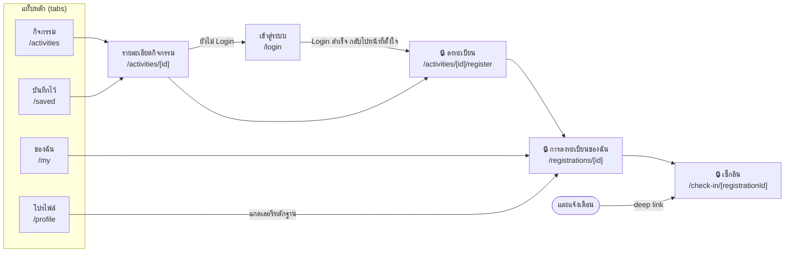
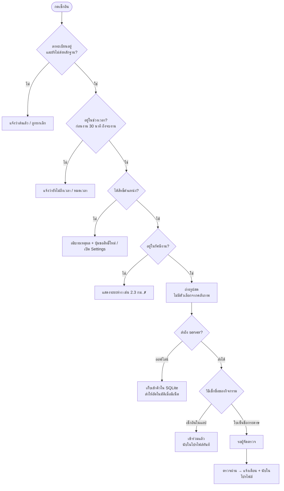
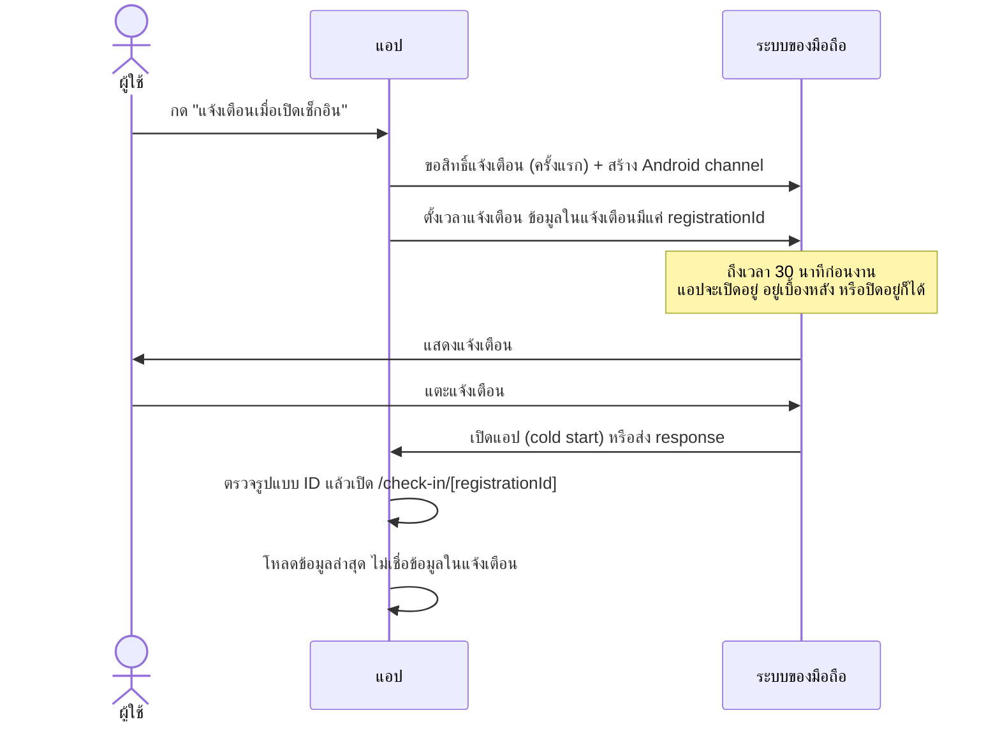
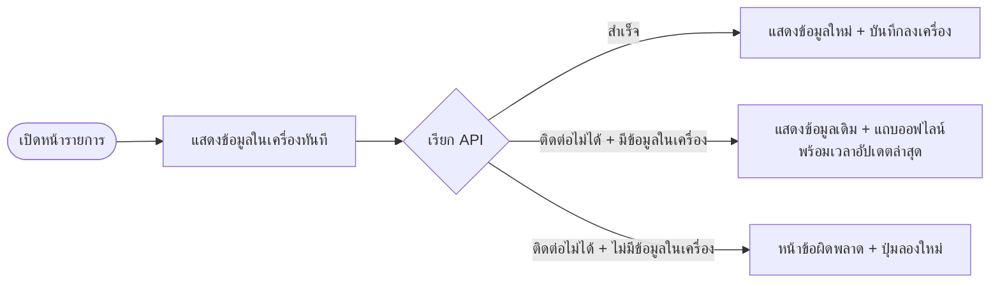

# แผนภาพการทำงานของ เช็กอินกิจกรรม

## 1. แผนผังหน้าจอ (Expo Router)

แท็บหลัก 4 หน้าอยู่ใน `(tabs)` ส่วนหน้ารายละเอียด ลงทะเบียน และเช็กอินอยู่ใน Root Stack จึงมีปุ่มย้อนกลับอัตโนมัติ
หน้าที่มีกุญแจ 🔒 ต้อง Login ก่อน (`Stack.Protected`)

## 2. ขั้นตอนเช็กอิน

ตรวจตามลำดับที่ผู้ใช้ควรรู้ก่อน: สถานะ → เวลา → ตำแหน่ง → รูป (`src/lib/check-in-rules.ts`)
server ตรวจเวลาและระยะทางซ้ำอีกรอบ เพราะค่าที่ส่งจากแอปแก้ไขได้

## 3. วงจรการแจ้งเตือน

## 4. การอ่านข้อมูลแบบออฟไลน์ก่อน (offline-first)

