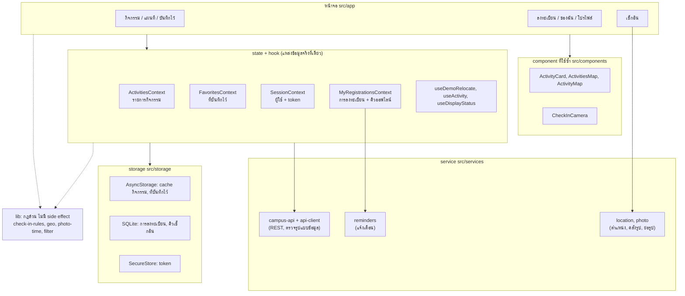

# สัปดาห์ 12: Architecture, Performance และ Accessibility

เอกสารนี้คือผลของ Lab 12: แผนภาพโครงสร้าง, หลักฐานการวัดประสิทธิภาพก่อน/หลัง และรายงานตรวจ accessibility

## 1. โครงสร้างและทิศทางข้อมูล

ข้อมูลไหลทางเดียว: **หน้าจอ → hook/state → service → API/storage/อุปกรณ์**
หน้าจอไม่เรียก `fetch`, ไม่รู้ key ของ storage และไม่เรียก API ของอุปกรณ์ (กล้อง คลังรูป ตำแหน่ง) เอง

| ขอบเขต | เหตุผล |
|---|---|
| **state 4 ตัว = แหล่งข้อมูลจริงที่เดียวของแต่ละเรื่อง** | กดดาวหน้าไหนก็เห็นตรงกันทุกหน้า ไม่มีสำเนาข้อมูลใน state ของหน้าจอ |
| **service ห่อ API และอุปกรณ์** | เปลี่ยน server หรือ library (เช่น image picker) แก้ไฟล์เดียว หน้าจอไม่ต้องรู้ |
| **storage แยกตามชนิดข้อมูล** | token ต้องเข้ารหัส (SecureStore) / คิวรูปใหญ่ลบทีละแถว (SQLite) / ที่เหลือเป็น JSON เล็ก (AsyncStorage) |
| **lib เป็นฟังก์ชันล้วน** | ทดสอบด้วย Jest ได้โดยไม่ต้อง mock อะไร (กฎเช็กอิน, ระยะทาง, เวลาถ่ายรูป) |

**ไม่ได้แยก folder `features/` และ `repositories/` ตามตัวอย่างในบทเรียน** เพราะแอปมี 5 เรื่องหลัก
ไฟล์ส่วนใหญ่ไม่เกิน ~200 บรรทัด context แต่ละตัวทำหน้าที่ repository อยู่แล้ว (รวม cache + API) การเพิ่มชั้นจะเพิ่มไฟล์โดยไม่ได้ประโยชน์

### สิ่งที่ refactor ในสัปดาห์นี้

หน้าเช็กอินเคยผสมทุกอย่างไว้ในไฟล์เดียว (509 บรรทัด) ตอนนี้เหลือ 357 บรรทัด

| ก่อน | หลัง |
|---|---|
| หน้าจอเรียก `expo-image-picker` และอ่าน EXIF เอง | `pickPhotoFromLibrary()` ใน `services/photo.ts` |
| หน้าจอเรียก API ย้ายสถานที่ และจัดการ token เอง | hook `useDemoRelocate()` |
| กล้อง, สิทธิ์กล้อง, ปุ่มชัตเตอร์ อยู่ในไฟล์หน้าจอ | `components/check-in-camera.tsx` |

ตรวจแล้ว: ไม่มีหน้าจอไหน import `expo-camera`, `expo-image-picker`, `expo-location`, SQLite หรือ AsyncStorage ตรง ๆ
ที่ยังเหลือโดยตั้งใจ: `toAbsoluteUrl` (แปลง path รูปเป็น URL ตอนแสดง ไม่เก็บ URL เต็มใน cache เพราะ IP ของเครื่องที่รัน server เปลี่ยนได้)

## 2. ประสิทธิภาพ: วัดก่อนแล้วค่อยแก้

**สิ่งที่วัด:** กดดาวที่การ์ดใบเดียวในหน้ากิจกรรม แล้วนับว่าการ์ดทั้งรายการ render ซ้ำกี่ใบ
**วิธีวัด:** `__tests__/performance.test.tsx` render หน้ากิจกรรมจริงที่มี 10 การ์ด นับการเรียก `formatDateRange` (การ์ดเรียก 2 ครั้งต่อการ render)

| | การ์ดที่ render ซ้ำ |
|---|---|
| ก่อนแก้ | **10 จาก 10 ใบ** |
| หลังแก้ | **1 จาก 10 ใบ** (เฉพาะใบที่กด) |

**สาเหตุ:** ทุกครั้งที่ state เปลี่ยน `toggleFavorite` และ `onOpen` ถูกสร้างเป็นฟังก์ชันใหม่ การ์ดทุกใบจึงเห็นว่า props เปลี่ยน

**สิ่งที่แก้ (เฉพาะที่วัดแล้วว่าเป็นปัญหา):**
1. ห่อ `ActivityCard` ด้วย `memo`
2. `toggleFavorite` ใช้ `useCallback` (ฟังก์ชันเดิมทุก render)
3. `openActivity` ประกาศนอก component

test นี้รันทุกครั้งใน CI ถ้าใครแก้แล้วการ์ดกลับมา render ซ้ำทั้งรายการ test จะไม่ผ่าน

**หมายเหตุ:** แอปเปิด React Compiler ไว้ (`app.json`) ซึ่งช่วย memo ให้อัตโนมัติบางส่วน แต่ Jest ไม่ได้รัน compiler
ตัวเลขข้างบนจึงเป็นกรณีไม่มี compiler การแก้นี้ยังได้ผลเหมือนกันเมื่อมี compiler
ยังไม่ได้วัดด้วย React DevTools Profiler บน development build

**จุดอื่นที่ทำไว้แล้วตั้งแต่ก่อนหน้า:** FlatList ใช้ `keyExtractor` เป็น id (ไม่ใช้ index), ย่อรูปเหลือกว้าง 960px ก่อนส่ง,
รูปในแกลเลอรีกำหนดขนาดตายตัว, หมุดบนแผนที่ปิด `tracksViewChanges` ไม่ให้วาดใหม่ทุกเฟรม

## 3. รายงานตรวจ Accessibility

พบและแก้ 9 ข้อ วัดค่าความต่างสี (contrast) ด้วยสูตร WCAG (ข้อความเล็กต้องได้ 4.5:1, ไอคอนต้องได้ 3:1)

| # | หมวด | ปัญหาที่พบ | แก้แล้ว |
|---|---|---|---|
| 1 | Contrast | การ์ดกิจกรรมที่จบแล้วใช้ `opacity 0.65` ข้อความสีเทาเหลือ **2.91:1** | ใช้สีพื้นหลังต่างกันแทน ข้อความกลับเป็น 5.86:1 (มีคำว่า "จบแล้ว" อยู่แล้ว) |
| 2 | Contrast | ป้าย "จิตอาสา" และป้ายสถานะสีเขียว (ตัวอักษร 12px) ได้ **4.42:1 และ 4.47:1** | เปลี่ยนสีเขียวเป็น `#146C38` ได้ 5.73:1 |
| 3 | Contrast | ดาวที่กดแล้ว (`#D99A06`) บนพื้นขาวได้ **2.45:1** | เปลี่ยนเป็น `#A87700` ได้ 3.96:1 |
| 4 | Contrast | การ์ดขั้นที่ 2 ของหน้าเช็กอินถูกหรี่ทั้งใบ (`opacity 0.6`) ข้อความอธิบายกฎอ่านยาก | เลิกหรี่ทั้งการ์ด หรี่เฉพาะปุ่มที่กดไม่ได้ |
| 5 | สื่อด้วยสีอย่างเดียว | ผลตรวจตำแหน่งบอกผ่าน/ไม่ผ่านด้วยสีและรูปไอคอนเท่านั้น screen reader อ่านแค่ระยะทาง | เพิ่มข้อความ "อยู่ในพื้นที่" / "อยู่นอกพื้นที่" |
| 6 | Screen reader | ขั้นตอนเช็กอินที่เสร็จแล้วรู้ได้จากวงกลมสีเขียวเท่านั้น | อ่านเป็น "ขั้นที่ 1 ตรวจตำแหน่ง เสร็จแล้ว" และเป็น header |
| 7 | Screen reader | ตัวเลข badge บนแท็บ "ของฉัน" ไม่ถูกอ่าน (ตรวจจาก source ของ tab bar: ป้ายเริ่มต้นมีแค่ชื่อแท็บ) | ป้ายแท็บเป็น "ของฉัน, รอตรวจหลักฐาน N รายการ" |
| 8 | พื้นที่แตะ | ปุ่มกรองประเภท (Chip) สูง **36** ต่ำกว่าขั้นต่ำ 44 | สูงอย่างน้อย 44 |
| 9 | ตัวอักษร 200% | วงกลมเลขขั้นตอน (28×28) และช่องตัวเลขในกราฟโปรไฟล์ (กว้าง 24) ขนาดตายตัว ตัวเลขล้น | ใช้ `minWidth` / `minHeight` ให้ขยายตาม, ตัวอักษรในรูปโปรไฟล์เป็นของตกแต่ง ซ่อนจาก screen reader และจำกัดการขยาย |

แผนที่รวมกิจกรรมใช้กับ screen reader ได้ยากโดยธรรมชาติ จึงบอกทางเลือกไว้ใต้แผนที่ว่า "ดูแบบรายการได้ที่แท็บกิจกรรม"

**ที่ผ่านอยู่แล้วตั้งแต่ก่อนหน้า:** ปุ่มทุกปุ่มมี `accessibilityRole` และ label, ปุ่มดาวแยกจากปุ่มการ์ด (ปุ่มซ้อนปุ่มอ่านสับสน),
ข้อความ error อยู่ใต้ช่องที่ผิดและประกาศด้วย `accessibilityRole="alert"`, Banner ใช้ทั้งไอคอน สี และข้อความ, แอปไม่มี animation ของตัวเอง

**ยังไม่ได้ทดสอบบนเครื่องจริง (ต้องทดสอบด้วยมือถือ):**
- เปิด TalkBack (Android) หรือ VoiceOver (iOS) แล้วลองเส้นทางหลัก: ค้นหา → ลงทะเบียน → เช็กอิน
- ตั้งขนาดตัวอักษรของเครื่องเป็นใหญ่สุด แล้วดูว่าทุกหน้ายังอ่านและกดได้

## คำถามท้ายบท

1. **abstraction แบบไหนเพิ่มความซับซ้อนโดยไม่ได้ประโยชน์?** ชั้นที่มีแค่ส่งต่อค่า เช่น repository ที่แค่เรียก service ต่ออีกทอด แอปนี้จึงไม่แยก `repositories/` เพราะ context ทำหน้าที่นี้อยู่แล้ว
2. **ทำไมต้องวัดก่อนปรับ?** ถ้าไม่วัดจะไม่รู้ว่าช้าตรงไหน และใส่ `memo` ทุกที่ทำให้โค้ดอ่านยากขึ้นโดยไม่เร็วขึ้น ในแอปนี้วัดแล้วแก้เฉพาะจุดเดียวที่ render ซ้ำ 10 เท่า
3. **ปัญหา accessibility กระทบผู้ใช้ทั่วไปอย่างไร?** ข้อความสีเทาจาง ๆ อ่านยากกลางแดด ปุ่มเล็กกดพลาดตอนเดิน และคำว่า "อยู่นอกพื้นที่" ช่วยทุกคน ไม่ใช่แค่คนที่ใช้ screen reader
